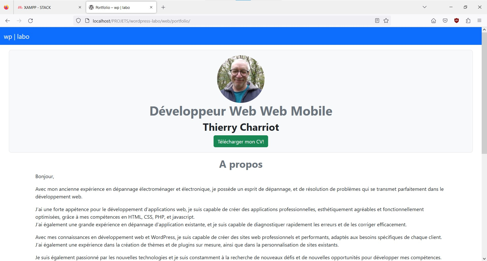

# Plugin Portfolio

## Installation

## Usage

Upload curriculum in Google Drive and go to edit profile to finish configuring. FirstName and LastName, Profession, links curriculum. Go to portfolio page and write about section and upload thumbnail. MVP: (Minimum Viable Product). WIP : (Work In Progress). At the end write Réalisations and Formations.

## Contributing
[makeareadme](https://www.makeareadme.com/)

## License
[Unlicense](https://choosealicense.com/licenses/unlicense/)
